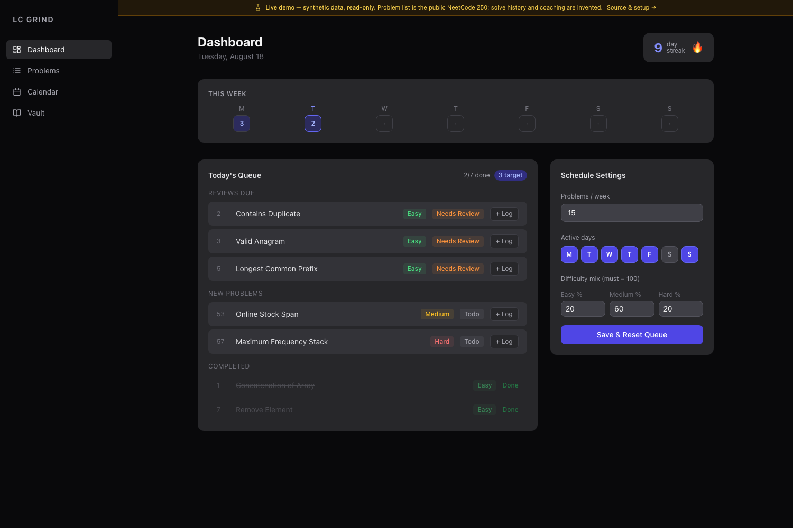
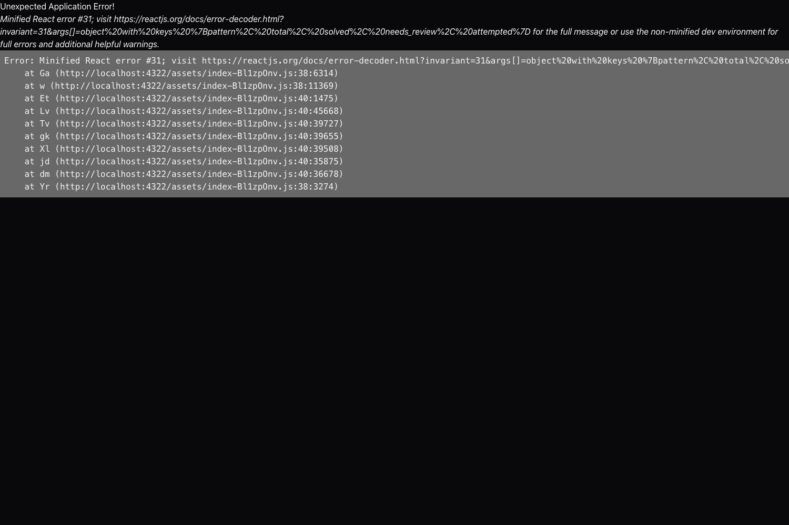
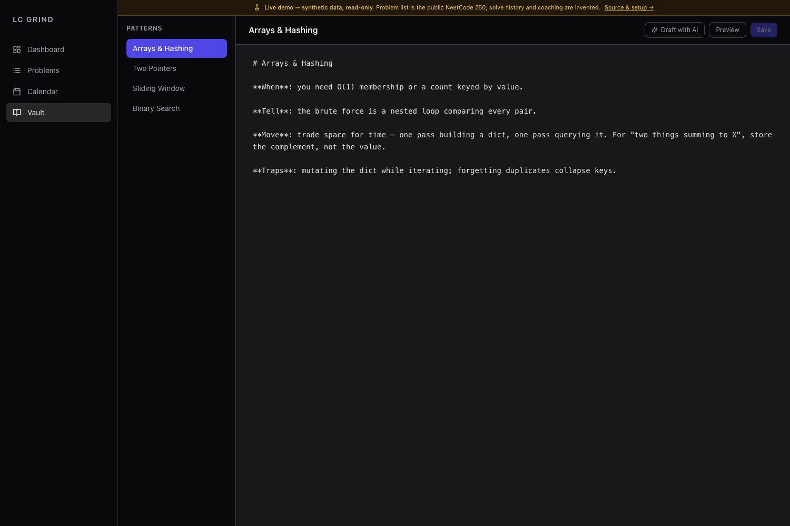

# LeetCode Grind

A practice coach that knows your full solve history. It schedules sessions, resurfaces problems by
spaced repetition, reads the code you actually wrote, and keeps a pattern vault you build as you go.

**[Live demo →](https://leetcode-grind.vercel.app)** — synthetic data, read-only.



---

## What it does

**Scheduling that adapts.** You set problems per week, a difficulty mix, and which days you're
active. The daily queue is assembled from two pools: reviews that have come due, and new problems
in NeetCode order. Reviews always come first — the point of spaced repetition is defeated by
letting new problems crowd out due ones.

**SM-2 spaced repetition over your own performance.** Every solve log carries status, time taken,
perceived difficulty, and the code. The interval schedule advances on clean solves and collapses
on a failure, so a problem you got wrong comes back tomorrow rather than in three weeks.

**A coach, not a tracker.** The whiteboard reads the code you wrote and responds in two modes —
`hint`, which asks the next question without giving the answer, and `explain`, which walks the
solution once you're done. It has your history, so it can point at the pattern you missed the last
three times rather than restating the editorial.

**A pattern vault you write.** Notes per pattern — when it applies, what the tell is, what the
trap is. The point is that *you* write them; the value is in having compressed the pattern
yourself, not in having read someone else's summary.




---

## Stack

| | |
|---|---|
| Backend | FastAPI, SQLAlchemy, SQLite, APScheduler |
| Frontend | React, TypeScript, Vite, TanStack Query, Tailwind |
| Scheduling | SM-2, implemented directly (`services/sm2.py`) |
| LLM | Anthropic API — required for the whiteboard, optional for everything else |

Problem set is the public NeetCode 250, shipped as `backend/data/neetcode250.json`.

---

## Running it locally

**Requires:** Python 3.11+, Node 18+.

```bash
git clone https://github.com/AashishAnanth/leetcode-grind
cd leetcode-grind

# backend → http://localhost:8000
cd backend
python3 -m venv venv && ./venv/bin/pip install -r requirements.txt
cp .env.example .env          # add ANTHROPIC_API_KEY for the whiteboard
./venv/bin/python seed.py     # loads the 250 problems
./venv/bin/uvicorn app.main:app --reload --port 8000

# frontend → http://localhost:5173
cd ../frontend
npm install && npm run dev
```

Open **Dashboard**, set your schedule in the right-hand panel, and start logging solves. The queue
rebuilds each day from what's due.

---

## This is built for one person

It is not a product. If you run it, expect to change things:

- **The problem set is fixed** to the NeetCode 250. Another list means another seed file with the
  same shape (`neetcode_order`, `title`, `slug`, `difficulty`, `pattern`, `leetcode_number`,
  `concepts`).
- **The SM-2 constants are tuned to one person's retention** (`services/sm2.py`). If your intervals
  feel wrong, they probably are — the numbers are not universal.
- **The whiteboard requires an Anthropic API key.** Everything else — scheduling, logging, the
  vault, stats — works without one.
- **Difficulty mix is enforced as a percentage split** that must total 100. If you want a different
  policy (pure NeetCode order, weakest-pattern-first), that's a change to the queue builder.
- **SQLite, single user, no auth.** It binds to localhost and assumes one person. Don't expose it.

---

## Known limitations

- **The coach is only as good as your logs.** Skip the code field and it has nothing to read; the
  hints degrade to generic ones.
- **Spaced repetition assumes honesty.** Marking a problem solved when you looked at the editorial
  poisons the interval schedule, and nothing detects it.
- **No contest or company tagging.** The scheduler orders by pattern and due date only.
- Demo mode ships synthetic fixtures; see `frontend/src/demo/`.

## License

MIT
